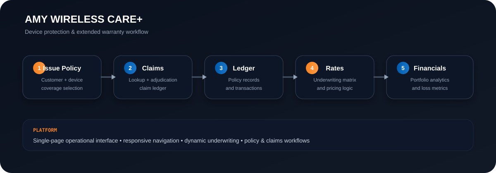

<div align="center">

# 🛡️ Amy Wireless Care+

### Device Protection & Extended Warranty Studio

**A modern insurance operations workspace for wireless retail, repair, and device protection.**

[](#)
[](#)
[](#)
[](#)

</div>

---

## ✨ What is Care+?

**Amy Wireless Care+** brings the core workflows of a device-protection operation into one focused workspace — from point-of-sale quotation and policy issuance through claims, policy records, underwriting/rates, and financial analytics.

It is designed around the way a wireless retailer actually operates: **quote → protect → service → track → analyze**.

### The operating flow

<div align="center">

**Issue Policy** → **Claims** → **Ledger** → **Rates** → **Financials**

</div>

---

## 🚀 Product Experience

| Workspace | Purpose |
|---|---|
| 🧾 **POS Quoter** | Capture customer/device information and build a protection plan at the point of sale. |
| 🛠️ **Claims** | Manage the claims lifecycle from intake through resolution. |
| 📒 **Policy Ledger** | Maintain policy-level records and payment/policy state. |
| 📊 **Rates & Underwriting** | Model coverage, deductibles, premiums, and underwriting assumptions. |
| 💹 **Financials** | Surface portfolio performance and actuarial/financial indicators. |
| 📜 **Customer Certificate** | Provide a clear record of the customer's protection coverage. |

---

## 🎯 Built for Wireless Retail

Care+ is structured for environments where a protection product has to work alongside the device sale — without turning the sales associate's workflow into an insurance back office.

**Core capabilities include:**

- Customer and device identification
- Modular protection coverage
- Deductible and premium calculations
- Monthly and upfront billing models
- Policy issuance and tracking
- Claims lifecycle management
- Rate and underwriting controls
- Portfolio analytics
- Payment workflow integration
- Customer-facing certificate generation

---

## 🧮 Actuarial & Pricing Model

The application is designed around transparent insurance economics rather than opaque pricing logic.

Typical calculations include:

```text
Coverage Amount
    = Insured Device Value × Coverage Factor

Premium
    = Base Rate × Coverage Amount × Risk Adjustment

Net Premium
    = Premium − Applicable Discounts

Loss Ratio
    = Incurred Claims ÷ Earned Premium
```

The model supports both **monthly** and **upfront** payment structures and exposes the assumptions needed to reason about profitability and portfolio performance.

> The exact rating implementation should be treated as the source of truth in the application code as rates evolve.

---

## 🏗️ Architecture



The application separates the operational experience into focused domains while keeping the policy lifecycle connected.

### Integration model

```text
┌───────────────────────────────┐
│       Amy Wireless POS        │
│   Quote • Coverage • Issue    │
└───────────────┬───────────────┘
                │
                ▼
┌───────────────────────────────┐
│     Cloudflare Worker API     │
│   Gateway • Validation • API  │
└───────────────┬───────────────┘
                │
                ▼
┌───────────────────────────────┐
│         Stripe Payments       │
│   Payment Intent / Status     │
└───────────────────────────────┘
```

The current project materials describe a **Cloudflare Worker gateway** around Stripe payment operations, with the frontend consuming the worker API.

---

## 🔌 Worker API

The documented worker interface includes these core routes:

| Endpoint | Purpose |
|---|---|
| `GET /health` | Service health check |
| `POST /create` | Create a payment workflow / PaymentIntent |
| `GET /check?id=pi_...` | Check payment status |

### Example health check

```bash
curl https://YOUR-WORKER-DOMAIN/health
```

Keep Stripe secrets **server-side**. The browser should communicate with the Worker rather than receiving private Stripe credentials.

---

## 🖥️ Running the Frontend

The repository currently contains the interactive Care+ HTML application.

### Option 1 — Open locally

Clone the repository and open the application HTML in a modern browser.

```bash
git clone https://github.com/alwazw/pawan-insurance.git
cd pawan-insurance
```

The existing prototype files are intentionally left untouched:

- `index.1.html`
- `index2.html`

They are **not** treated as the README landing page.

### Option 2 — Static hosting

The application can be deployed to a static host once the preferred production entry point is selected. GitHub Pages is a natural fit for the frontend because the current UI is browser-based.

---

## 🎨 Amy Brand System

The UI uses a dark operational dashboard aesthetic with Amy Wireless branding.

| Token | Value |
|---|---|
| Amy Blue | `#005BAC` |
| Amy Orange | `#F58220` |
| Dark | `#0B111E` |
| Card | `#111927` |
| Border | `#1E293B` |

The goal is a high-density **operations console** rather than a generic marketing page: clear hierarchy, compact data presentation, strong calls to action, and financial/insurance terminology that stays visible in context.

---

<details>
<summary><strong>📦 Repository structure</strong></summary>

```text
pawan-insurance/
├── README.md
├── index.1.html
├── index2.html
└── assets/
    └── amy-care-plus-architecture.svg
```

The `index.1.html` and `index2.html` files are existing application prototypes and are intentionally not modified by the README work.

</details>

<details>
<summary><strong>🔐 Security notes</strong></summary>

- Never commit Stripe secret keys or other credentials.
- Keep payment secrets in the Cloudflare Worker environment.
- Treat the browser as an untrusted client.
- Validate payment and policy state on the server side.
- Use HTTPS for production deployments.
- Avoid placing customer-sensitive information into public repositories, screenshots, or demo environments.

</details>

<details>
<summary><strong>🧭 Product roadmap</strong></summary>

Potential production-hardening areas include:

- [ ] Select and promote a single production entry-point HTML file
- [ ] Deploy the frontend through GitHub Pages or another static host
- [ ] Connect production Worker environment variables
- [ ] Add persistent policy storage
- [ ] Add authentication and role-based access
- [ ] Add audit logging
- [ ] Add automated tests for rating and payment workflows
- [ ] Add production claims persistence and document handling
- [ ] Add CI validation for frontend assets and Worker code

</details>

---

## 📈 Why this project is different

Care+ is not just a form for selling an extended warranty. The design treats the protection product as an **operating system for the insurance lifecycle**:

> **Sell the coverage. Record the policy. Service the claim. Understand the portfolio.**

That makes the same interface useful to a sales associate, operations team, claims team, and financial/underwriting stakeholders — while keeping the customer/device relationship at the center.

---

## 📄 License

No license is currently declared in the repository. Add an explicit `LICENSE` file before distributing the project publicly.

---

<div align="center">

### Amy Wireless Care+

**From device sale to protection lifecycle.**

</div>
